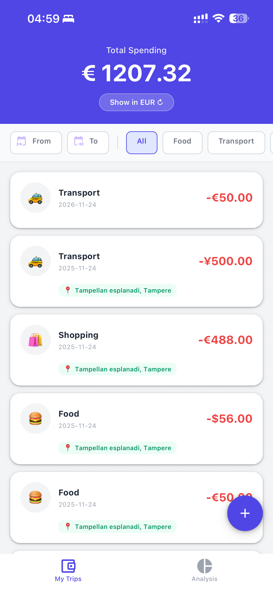
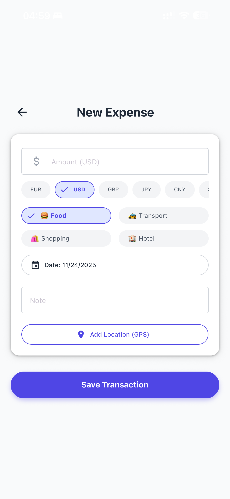
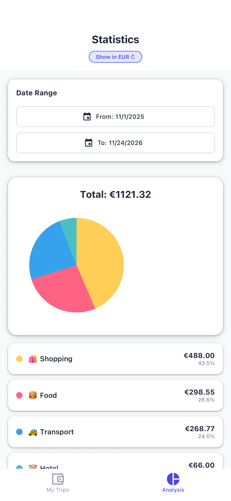
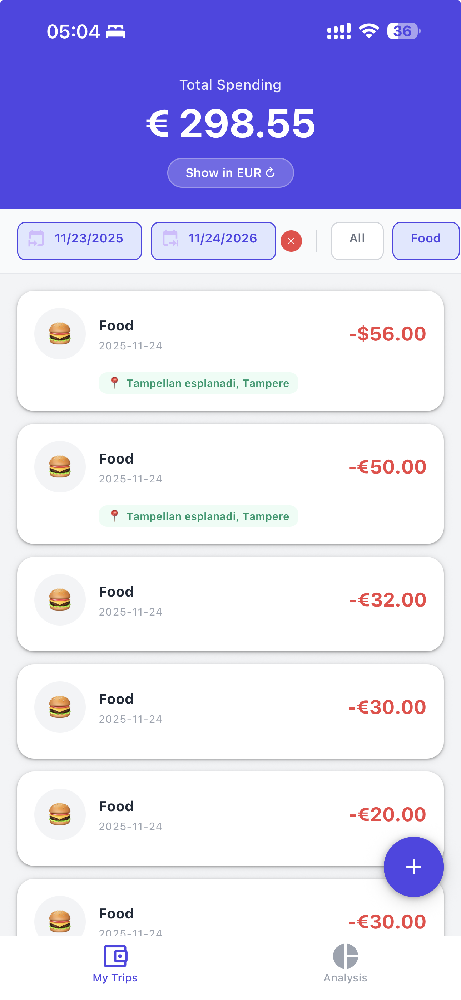

# Mobile App Development 2 - Project Report

**Project Name:** TravelWallet
**Student Name:** [在此填入你的名字]
**Student ID:** [在此填入你的学号]
**Date:** December 15, 2025

---

## 1. App Description

### Overview
**TravelWallet** is a comprehensive expense tracking application tailored for international travelers. Unlike standard finance apps, it addresses the specific challenge of managing spending across multiple currencies. The app allows users to record expenses in various foreign currencies (USD, JPY, GBP, etc.) and automatically calculates the total expenditure in their home currency (EUR) using real-time exchange rates.

### Key Features
* **Multi-Currency Support:** Seamlessly record transactions in 6+ major currencies while maintaining a unified total in EUR.
* **Real-Time Currency Conversion:** Integrates with an external API to fetch live exchange rates, ensuring financial accuracy.
* **GPS Location Tagging:** Utilizes the device's GPS interface to automatically tag expenses with the precise street address via reverse geocoding.
* **Visual Data Analytics:** Features a dedicated statistics dashboard with interactive pie charts and custom date range filtering to analyze spending habits.
* **Advanced Filtering:** Users can filter their transaction history by specific categories (Food, Transport, etc.) or custom timeframes directly on the home screen.

### Target Audience
The app is designed for tourists, business travelers, and expatriates who need a reliable, offline-capable tool to track their budget without the mental burden of manual currency conversion.

---

## 2. Screenshots

> *Instruction: Please place your screenshots in a folder named 'screenshots' inside your project directory and ensure the filenames match below.*

| **Home Screen** | **Add Expense (GPS)** |
| :---: | :---: |
|  <br> *Displays expense list, total spending, and filters* |  <br> *Shows input form, currency selection, and GPS location* |

| **Statistics Page** | **Date Picker & Filters** |
| :---: | :---: |
|  <br> *Visual pie chart and category breakdown* |  <br> *Date range picker and category chips* |

---

## 3. Essential Code Snippets

### A. User Interface (Modern UI)
I utilized `react-native-paper` to create a consistent Material Design interface. Below is the custom card implementation that handles emojis, dynamic currency symbols, and visual hierarchy.

```javascript
// app/index.js - Custom Card Rendering
const renderItem = ({ item }) => {
  const emoji = CATEGORY_EMOJIS[item.category] || '💰';
  const symbol = getCurrencySymbol(item.currency || 'EUR');
  const locationText = item.address || "GPS Tagged";

  return (
    <TouchableOpacity onPress={() => handlePressCard(item)} activeOpacity={0.7}>
      <Card style={styles.card} mode="elevated">
        <View style={styles.cardContent}>
          <View style={styles.rowTop}>
            <View style={styles.leftSection}>
              <View style={styles.emojiContainer}>
                <Text style={styles.emojiText}>{emoji}</Text>
              </View>
              <View style={{ marginLeft: 12 }}>
                <Text variant="titleMedium" style={styles.categoryText}>{item.category}</Text>
                <Text variant="bodySmall" style={styles.dateText}>{item.date.split('T')[0]}</Text>
              </View>
            </View>
            <Text variant="titleLarge" style={styles.amountText}>
              -{symbol}{item.amount.toFixed(2)}
            </Text>
          </View>
          {/* Conditional Rendering for Location Tag */}
          {item.address && (
            <View style={styles.locationPill}>
              <Text style={{ fontSize: 12 }}>📍</Text>
              <Text style={styles.locationText} numberOfLines={1}>{locationText}</Text>
            </View>
          )}
        </View>
      </Card>
    </TouchableOpacity>
  );
};
```

### B. Backend Connection (Fetch API)
The app satisfies the "Backend Connection" requirement by connecting to the external `exchangerate-api.com` to fetch real-time currency data. This allows the app to normalize all expenses into a base currency (EUR).

```javascript
// File: app/index.js
// Purpose: Fetches live exchange rates asynchronously when the app starts.

const fetchRates = async () => {
  setLoadingRates(true);
  try {
    // Sending GET request to external API
    // Base currency is set to EUR
    const response = await fetch('[https://api.exchangerate-api.com/v4/latest/EUR](https://api.exchangerate-api.com/v4/latest/EUR)');
    
    if (!response.ok) {
      throw new Error('Network response was not ok');
    }

    const data = await response.json();
    setRates(data.rates); // Storing the rates object in component state
  } catch (error) {
    console.error("API Error:", error);
    // Error handling could be extended here (e.g., showing a Snackbar)
  } finally {
    setLoadingRates(false);
  }
};
```

### C. Device Interface Usage (GPS & Geocoding)
I utilized `expo-location` to access the device's GPS hardware. The app not only gets the raw coordinates (Device Sensor) but also performs reverse geocoding to convert them into a human-readable address.

```javascript
// File: app/add.js
// Purpose: Handles permission requests and retrieves current location data.

const handleGetLocation = async () => {
  setLoading(true);
  
  // 1. Request Permissions (Critical for iOS/Android)
  let { status } = await Location.requestForegroundPermissionsAsync();
  if (status !== 'granted') {
    Alert.alert('Permission needed', 'Allow location access to tag expenses.');
    setLoading(false);
    return;
  }

  try {
    // 2. Access GPS Sensor to get Coordinates
    let userLocation = await Location.getCurrentPositionAsync({});
    const { latitude, longitude } = userLocation.coords;
    setLocation({ lat: latitude, lng: longitude });

    // 3. Reverse Geocode: Convert Lat/Long to Street Address
    let addressResponse = await Location.reverseGeocodeAsync({ latitude, longitude });
    
    if (addressResponse.length > 0) {
      const item = addressResponse[0];
      // Construct a readable string (e.g., "Main St, Helsinki")
      const formattedAddress = `${item.street || ''}, ${item.city || ''}`;
      setAddressText(formattedAddress);
    }
  } catch (error) {
    Alert.alert('Error', 'Could not fetch GPS signal');
  } finally {
    setLoading(false);
  }
};
```

### D. Local Data Storage (AsyncStorage)
To ensure the app works offline and data persists between sessions, I utilized `AsyncStorage`. I created a helper service `storage.js` to handle data operations.

```javascript
// File: src/storage.js
// Purpose: Manages persistent data storage for expenses using AsyncStorage.

import AsyncStorage from '@react-native-async-storage/async-storage';
const STORAGE_KEY = 'travel_wallet_expenses';

// Create: Add a new expense to the top of the list
export const saveExpense = async (newExpense) => {
  try {
    const existingData = await getExpenses();
    // Prepend new item to ensure latest shows first
    const updatedData = [newExpense, ...existingData];
    await AsyncStorage.setItem(STORAGE_KEY, JSON.stringify(updatedData));
    return true;
  } catch (e) {
    console.error("Saving error:", e);
    return false;
  }
};

// Read: Retrieve all expenses
export const getExpenses = async () => {
  try {
    const jsonValue = await AsyncStorage.getItem(STORAGE_KEY);
    return jsonValue != null ? JSON.parse(jsonValue) : [];
  } catch (e) {
    return [];
  }
};
```
## 4. Own Reflections / Learning

### What I Learned
Building **TravelWallet** was a significant learning milestone.
* **Expo Router & Navigation:** I mastered the file-based routing system and how to pass parameters between screens (e.g., passing an ID to the 'Add' screen for editing).
* **State Management:** I learned how to manage complex states, such as the "Display Currency" toggle on the home screen, which triggers a recalculation of the entire expense list in real-time.
* **Hardware Integration:** Implementing `expo-location` gave me practical experience in handling asynchronous permissions and processing GPS coordinates into readable addresses.

### Challenges Encountered
1. **The "Sticky Params" Bug:** One major challenge was that the "Add Expense" screen would retain data from a previous edit session when I navigated back via the tab bar. I solved this by utilizing the `useFocusEffect` hook to detect when the screen comes into focus and resetting the form state accordingly.
2. **UI Adaptation for Notch/Dynamic Island:** The header content was initially obscured on newer iPhones. I resolved this by using `react-native-safe-area-context` to apply dynamic padding based on the device's physical insets.
3. **Dark Mode Conflicts:** The iOS date picker text was invisible in dark mode. I fixed this by explicitly forcing the `themeVariant="light"` and setting the text color to black.

### Future Improvements
If I were to continue developing this app, I would add:
* **Cloud Sync (Firebase):** To allow users to access their data across multiple devices.
* **Receipt Scanning (OCR):** Using camera vision to automatically extract the amount and date from a physical receipt.
* **Budget Alerts:** Setting a daily or trip budget and receiving notifications when nearing the limit.

---

## 5. GitHub Link

**Repository:** [https://github.com/philwang612/TravelWallet]

*(Note: The repository contains the full source code, assets, and a README file with setup instructions.)*